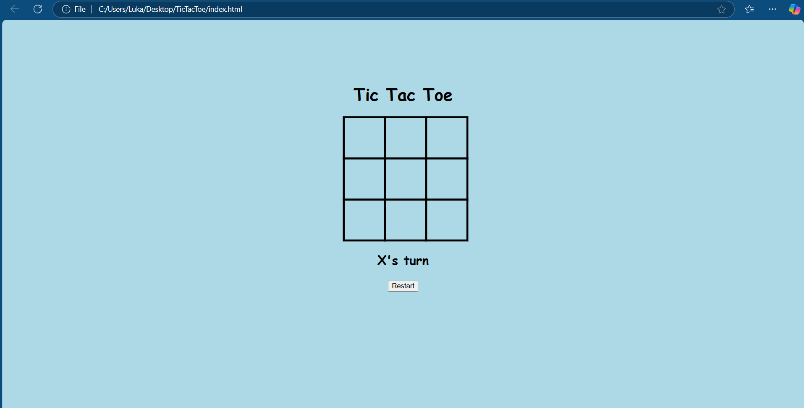

# TicTacToe
This is a simple and fun Tic-Tac-Toe web application built using only HTML, CSS, and JavaScript. The project highlights essential front-end development skills while offering a smooth and interactive user experience.

## Features  
- **Two-Player Mode:** Play against a friend on the same device.  
- **Responsive Design:** Adapts seamlessly to desktop and mobile devices.  
- **Dynamic Gameplay:** Displays player turns and game outcomes (win, lose, or draw).  
- **Restart Button:** Allows players to reset the game board and start a new match.  

## Technologies Used  
- **HTML5:** Structure and layout of the application.  
- **CSS3:** Styling for a clean and responsive design.  
- **JavaScript:** Logic for gameplay, player turns, and winner detection.  

## How to Play  
1. Download or clone the repository:  
   ```bash
   git clone https://github.com/Duk0ski/TicTacToe.git
2. Open the index.html file in your preferred web browser.
3. Take turns clicking on the cells to mark X or O.
4. The game will automatically determine the winner or declare a draw.
5. Click the "Restart" button to start a new game.

File Structure
index.html: Main HTML structure for the game.
style.css: CSS file for styling the game.
script.js: JavaScript file containing the game logic.

Preview


## Future Enhancements
- **Implement AI for a single-player mode.**
- **Add animations for a better user experience.**
- **Allow online multiplayer functionality.**

## License
This project is open source and available under the MIT License.
